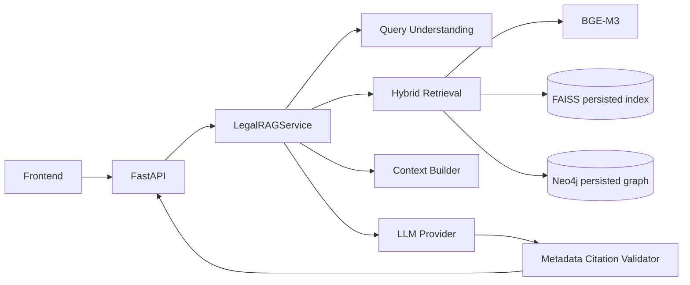

## BGE-M3 Embedding Service

The reusable embedding service is in [source/embedding_service.py](source/embedding_service.py). It uses `BAAI/bge-m3` by default, detects CUDA/MPS/CPU, caches one model per configuration, batches input, truncates to the configured maximum sequence length, and L2-normalizes vectors.

Run the focused tests:

```powershell
pytest -q tests/test_embedding_service.py
```

Example usage with Vietnamese legal text:

```python
from source.embedding_service import EmbeddingConfig, EmbeddingService, LegalChunk

service = EmbeddingService(EmbeddingConfig(batch_size=8, max_seq_length=2048))
chunks = [
        LegalChunk("Điều 1. Phạm vi điều chỉnh của Luật này là ..."),
        LegalChunk("Điều 2. Đối tượng áp dụng gồm cơ quan, tổ chức và cá nhân ..."),
]
vectors = service.embed_chunks(chunks)
query_vector = service.embed_query("Đối tượng nào phải tuân thủ quy định này?")
print(vectors.shape, query_vector.shape)
```

The first run downloads the model from Hugging Face. Configure `EmbeddingConfig(model_name=..., batch_size=..., max_seq_length=..., device=...)` when needed; leave `device=None` for automatic detection. This branch intentionally does not implement FAISS, Neo4j, or an LLM.

Commit and push:

```powershell
git add source/embedding_service.py tests/test_embedding_service.py README.md
git commit -m "feat: add BGE-M3 embedding service"
git push -u origin feature/embedding-bge-m3
```

## FAISS Vector Store

The FAISS store is in [source/faiss_vector_store.py](source/faiss_vector_store.py). FAISS stores vectors and numeric IDs; the corresponding `LegalChunk` records are persisted in a JSON sidecar file.

```python
import numpy as np
from source.embedding_service import EmbeddingService, LegalChunk
from source.faiss_vector_store import FaissVectorStore, VectorStoreConfig

chunks = [
        LegalChunk("Điều 1. Phạm vi điều chỉnh ...", chunk_id="law-1"),
        LegalChunk("Điều 2. Đối tượng áp dụng ...", chunk_id="law-2"),
]
embeddings = EmbeddingService().embed_chunks(chunks)

store = FaissVectorStore(VectorStoreConfig(
        dimension=embeddings.shape[1],
        top_k=5,
        metric="cosine",  # cosine, ip, or l2
        index_type="flat",  # flat or hnsw
))
store.create_index()
store.add_vectors(embeddings, chunks)
store.save("processed/legal_chunks.faiss")

query_embedding = EmbeddingService().embed_query("Ai thuộc đối tượng áp dụng?")
for result in store.search(query_embedding):
        print(result.score, result.chunk.chunk_id, result.chunk.text)
```

Load an existing index with `store.load("processed/legal_chunks.faiss")`; the default metadata file is `processed/legal_chunks.metadata.json`. Use `store.delete([vector_id])` to remove vectors and their metadata. This branch intentionally does not implement Neo4j or an LLM.

Run the focused tests:

```powershell
pytest -q tests/test_faiss_vector_store.py
```

Commit and push:

```powershell
git add source/faiss_vector_store.py tests/test_faiss_vector_store.py README.md requirements.txt
git commit -m "feat: add FAISS vector store"
git push -u origin feature/faiss-vector-store
```

## Neo4j Knowledge Graph

The repository/service layer is in [graph_neo4j/knowledge_graph.py](graph_neo4j/knowledge_graph.py). It manages the Neo4j driver, transactions, schema constraints/indexes, `Document` and `Chunk` upserts, `PART_OF` links, whitelisted `AMENDS`/`REPLACES`/`ABROGATES` relationships, and document/chunk queries.

Setup with Docker:

```powershell
Copy-Item .env.example .env
# Change NEO4J_PASSWORD in .env before starting a shared environment.
docker compose --file docker-compose.neo4j.yml up -d
```

Example configuration and repository usage:

```python
from graph_neo4j.knowledge_graph import (
        ChunkRecord, DocumentRecord, KnowledgeGraphRepository,
        Neo4jConfig, Neo4jConnection,
)

with Neo4jConnection(Neo4jConfig.from_env()) as connection:
        graph = KnowledgeGraphRepository(connection)
        graph.ensure_schema()
        graph.upsert_document(DocumentRecord(
                document_id="law-1",
                title="Luật thử nghiệm",
                so_ky_hieu="01/2026/QH15",
                loai_van_ban="Luật",
                ngay_ban_hanh="2026-01-01",
                tinh_trang_hieu_luc="Còn hiệu lực",
        ))
        graph.upsert_chunks([
                ChunkRecord("law-1-c0", "law-1", "Điều 1. Phạm vi điều chỉnh...", 0),
        ])
```

Run unit tests without Neo4j:

```powershell
pytest -q tests/test_neo4j_repository.py
```

For integration tests, start the Compose service, export the same `.env` values, then run a separate test suite marked `integration` against `NEO4J_URI`. The repository tests use a fake driver and do not require a live database.

Git:

```powershell
git add graph_neo4j/knowledge_graph.py graph_neo4j/config.py docker-compose.neo4j.yml .env.example tests/test_neo4j_repository.py README.md
git commit -m "feat: add Neo4j knowledge graph layer"
git push -u origin feature/neo4j-knowledge-graph
```

## Query Understanding

The query understanding module is in [source/query_understanding.py](source/query_understanding.py). `QueryUnderstandingService` exposes a stable interface while `RuleBasedQueryUnderstanding` provides the deterministic baseline; it can later be replaced with an LLM or NER backend implementing `understand(question)`.

The structured output includes the original question, intent, typed entities, normalized entities, legal terms, article/clause/point references, and document identifiers. Vietnamese diacritics are preserved in the original query and normalized with Unicode NFC plus case folding for matching.

Run its tests:

```powershell
pytest -q tests/test_query_understanding.py
```

Git:

```powershell
git add source/query_understanding.py tests/test_query_understanding.py README.md
git commit -m "feat: add legal query understanding"
git push -u origin feature/query-understanding
```

## Hybrid Retrieval

The hybrid engine is in [source/hybrid_retrieval.py](source/hybrid_retrieval.py). It runs Query Understanding, embeds the query for FAISS, retrieves graph candidates using legal entities/articles/relationships/validity, normalizes scores per source, fuses configurable vector/graph/entity weights, and deduplicates chunks before ranking.

```python
from source.embedding_service import EmbeddingService
from source.faiss_vector_store import FaissVectorStore
from source.hybrid_retrieval import HybridRetrievalEngine, Neo4jGraphRetriever
from source.query_understanding import QueryUnderstandingService

engine = HybridRetrievalEngine(
        embedding_service=EmbeddingService(),
        vector_store=vector_store,
        graph_retriever=Neo4jGraphRetriever(neo4j_connection),
        query_understanding=QueryUnderstandingService(),
)
result = engine.retrieve("Khoản 2 Điều 5 của Luật Đất đai quy định gì?", top_k=5)
for chunk, score, sources in zip(result.chunks, result.scores, result.retrieval_sources):
        print(score, sources, chunk.chunk_id, chunk.text)
```

Adjust `HybridRetrievalConfig` and `RetrievalWeights` for vector/graph balance; no final answer generation is included.

Run tests:

```powershell
pytest -q tests/test_hybrid_retrieval.py
```

Git:

```powershell
git add source/hybrid_retrieval.py tests/test_hybrid_retrieval.py README.md
git commit -m "feat: add hybrid retrieval engine"
git push -u origin feature/hybrid-retrieval
```
# Vietnamese Legal Data Pipeline

A data processing pipeline for Vietnamese legal documents, designed to support Knowledge Graph (KG), Retrieval-Augmented Generation (RAG), and Legal Question Answering systems.

This project processes the **Vietnamese Legal Documents** dataset from Hugging Face by cleaning, transforming, analyzing, and preparing the data for downstream applications such as vector databases and knowledge graphs.

---

## Features

- Load Vietnamese legal documents from Hugging Face
- Merge metadata and document contents
- Perform exploratory data analysis (EDA)
- Remove duplicated records
- Convert HTML documents to plain text
- Generate document statistics
- Export clean datasets
- Prepare data for chunking and embedding
- Export relationships for Knowledge Graph construction

---

## Dataset

Dataset:
`th1nhng0/vietnamese-legal-documents`

Configurations used:

- **metadata** – document metadata
- **content** – HTML content
- **relationships** – relationships between legal documents

## Pipeline

```
Metadata
        │
Content
        │
Relationships
        │
        ▼
Load Dataset
        ▼
Merge
        ▼
Data Cleaning
        ▼
EDA
        ▼
HTML → Plain Text
        ▼
Export Clean Dataset
        ▼
Chunking (Next Stage)
        ▼
Embedding (Next Stage)
```


---

## Installation

Clone repository

```bash
git clone https://github.com/Legal-chatbot/legal-data-pipeline.git
cd legal-data-pipeline
```

---

## Usage

Load dataset

```python
from datasets import load_dataset

meta = load_dataset(
    "th1nhng0/vietnamese-legal-documents",
    "metadata",
    split="data"
)

content = load_dataset(
    "th1nhng0/vietnamese-legal-documents",
    "content",
    split="data"
)

relationships = load_dataset(
    "th1nhng0/vietnamese-legal-documents",
    "relationships",
    split="data"
)
```


## Technologies

- Python
- Pandas
- Hugging Face Datasets
- BeautifulSoup4
- PyArrow
- Jupyter Notebook

---

## Next Stage

The processed data produced by this repository will be used in:

- Knowledge Graph construction
- Chunk generation
- Text embedding
- Vector database (FAISS / ChromaDB)
- Hybrid Retrieval
- Legal Chatbot

## Production Integration

### Architecture



The production entry point is `source.production_runtime:app`. Startup validates environment, connects to Neo4j, loads the persisted FAISS index and metadata sidecar, builds the dependency-injected RAG graph, and starts serving only after those dependencies are ready. Shutdown closes the Neo4j driver. No retrieval or model logic is placed in the HTTP route.

### Setup

1. Prepare the environment and persisted index:

```powershell
Copy-Item .env.production.example .env
# Set NEO4J_PASSWORD and LLM_API_KEY. Set FAISS_DIMENSION to the index dimension.
```

2. Ensure `processed/legal_chunks.faiss` and its `.metadata.json` sidecar exist. The FAISS index is mounted read-only into the API container; Neo4j data and logs use named Docker volumes.

3. Start production services:

```powershell
docker compose --file docker-compose.production.yml up --build -d
```

4. Check readiness and API docs:

```powershell
Invoke-RestMethod http://127.0.0.1:8000/health/ready
Start-Process http://127.0.0.1:8000/docs
```

For local development, run `uvicorn source.fastapi_rag_api:app --reload` with an injected service, or serve [frontend/index.html](frontend/index.html) on port 5500. Set `FRONTEND_ORIGINS` and `ALLOWED_HOSTS` explicitly outside local development.

### Testing

```powershell
pytest -q tests
```

The suite includes unit tests for the individual layers, mock full-pipeline integration tests, API contract tests, lifecycle/readiness tests, citation validation tests, and evaluation framework tests. A live Neo4j/LLM is not required for CI. For a smoke test with real dependencies, start Compose and call `/health/ready` before sending `/api/v1/chat`.

### Performance

Profile a real configured request with:

```powershell
python profile_rag.py "Khoản 2 Điều 5 quy định gì?" --output rag-profile.prof
```

The script prints cumulative hot paths and writes a cProfile artifact. Request metadata also contains per-stage latency from the RAG orchestrator and total API latency.

### Security and operations

Never commit `.env`, API keys, passwords, model credentials, or persisted sensitive data. Production configuration requires `NEO4J_PASSWORD`, `LLM_API_KEY`, a valid FAISS index/sidecar, and uses `ALLOWED_HOSTS` plus explicit CORS origins. The API validates query length, generates/propagates request IDs, avoids exposing exception causes in HTTP responses, and logs request/stage timing without logging secrets.

## Evaluation

The evaluation framework is in [source/evaluation.py](source/evaluation.py). It supports JSON/CSV datasets with `question`, `ground_truth_documents`, `ground_truth_articles`, `ground_truth_answer`, and optional `ground_truth_intent`. Retrieval reports include Recall@K, Precision@K, MRR, and Hit Rate; generation reports include faithfulness, context relevance, answer relevance, and citation correctness.

CLI scripts:

```powershell
python evaluate_retrieval.py --dataset data/eval.json --predictions evaluation/vector.json --mode vector --output evaluation/vector
python evaluate_retrieval.py --dataset data/eval.json --predictions evaluation/graph.json --mode graph --output evaluation/graph
python evaluate_retrieval.py --dataset data/eval.json --predictions evaluation/hybrid.json --mode hybrid --output evaluation/hybrid
python evaluate_generation.py --dataset data/eval.json --predictions evaluation/generation.json --output evaluation/generation
python evaluate_full_pipeline.py --dataset data/eval.json --predictions evaluation/full.json --output evaluation/full
```

Each report writes JSON, CSV, and `.summary.txt`. Comparing the vector, graph, and hybrid summaries on the same examples demonstrates whether hybrid retrieval improves recall, precision, MRR, and hit rate.

Run tests:

```powershell
pytest -q tests/test_evaluation.py
```

---

## License

This project is intended for research and educational purposes.

## LLM Answer Generation

The grounded answer service is in [source/llm_answer_service.py](source/llm_answer_service.py). `LLMProvider` is the replaceable interface; `OpenAICompatibleProvider` is the first API implementation. It reads `LLM_API_KEY` from the environment, supports configurable endpoint/model, timeout, retry and backoff, and never calls an API when retrieved context is empty.

The system prompt requires the model to use only supplied legal context, never invent legal rules, disclose insufficient context, cite sources, distinguish legal information from reasoning, and avoid unsupported claims. No frontend or real LLM call is included in this branch.

Example setup:

```powershell
$env:LLM_API_KEY = "your-api-key"
$env:LLM_API_URL = "https://api.openai.com/v1/chat/completions"
$env:LLM_MODEL = "gpt-4o-mini"
```

Run mock tests without an API call:

```powershell
pytest -q tests/test_llm_answer_service.py
```

Git:

```powershell
git add source/llm_answer_service.py tests/test_llm_answer_service.py README.md
git commit -m "feat: add grounded LLM answer generation"
git push -u origin feature/llm-answer-generation
```

## RAG Orchestrator

The complete pipeline coordinator is in [source/rag_orchestrator.py](source/rag_orchestrator.py). `LegalRAGService.answer(query)` invokes query understanding, retrieval, context building, and answer generation through injected component interfaces. It does not duplicate the business logic of those components.

Each request records a request ID, per-stage duration, status, and lightweight debug details in `LegalAnswer.retrieval_information["rag_trace"]`. Stage failures raise `RAGStageError` with the failed stage and preserve the partial trace in `service.last_trace`.

```python
from source.rag_orchestrator import LegalRAGService

rag = LegalRAGService(
        query_understanding=query_understanding_service,
        retrieval=hybrid_retrieval_engine,
        context_builder=context_builder,
        answer_generation=llm_answer_generation_service,
)
answer = rag.answer("Khoản 2 Điều 5 quy định gì?")
print(answer.answer)
print(answer.retrieval_information["rag_trace"])
```

Run the mock integration tests:

```powershell
pytest -q tests/test_rag_orchestrator.py
```

Git:

```powershell
git add source/rag_orchestrator.py source/hybrid_retrieval.py tests/test_rag_orchestrator.py README.md
git commit -m "feat: add legal RAG orchestrator"
git push -u origin feature/rag-orchestrator
```

## Legal Citation

The metadata-backed citation system is in [source/legal_citation.py](source/legal_citation.py). It creates `Citation -> SourceDocument -> SourceChunk` objects from retrieved context, including title, document number, article, clause, point, and validity status. The LLM receives a registry such as `[C1]` and cannot create trusted citations outside that registry.

Unknown citation markers are represented as `is_valid=False`; citations not used by the LLM are `is_trusted=False`. The answer service exposes invalid/missing citation warnings and validation details in `LegalAnswer.retrieval_information["citation_validation"]`.

Run tests:

```powershell
pytest -q tests/test_legal_citation.py tests/test_llm_answer_service.py
```

Git:

```powershell
git add source/legal_citation.py source/llm_answer_service.py tests/test_legal_citation.py tests/test_llm_answer_service.py README.md
git commit -m "feat: add metadata-backed legal citations"
git push -u origin feature/legal-citation
```

## FastAPI RAG API

The HTTP adapter is in [source/fastapi_rag_api.py](source/fastapi_rag_api.py). Routes contain no retrieval logic; inject a configured `LegalRAGService` with `create_app(service)`.

Run the API after wiring the real RAG components:

```powershell
uvicorn source.fastapi_rag_api:app --reload
```

Endpoints:

```text
GET  /health
GET  /api/v1
POST /api/v1/chat
GET  /docs
```

Example request:

```powershell
Invoke-RestMethod -Method Post -Uri http://127.0.0.1:8000/api/v1/chat `
        -ContentType "application/json" `
        -Headers @{ "X-Request-ID" = "demo-request-1" } `
        -Body '{"query":"Khoản 2 Điều 5 quy định gì?"}'
```

The response includes `answer`, metadata-derived `citations`, `sources`, request ID, latency, warnings, and RAG trace metadata. API tests use an injected mock service and do not call an LLM.

Run tests:

```powershell
pytest -q tests/test_fastapi_rag_api.py
```

Git:

```powershell
git add source/fastapi_rag_api.py tests/test_fastapi_rag_api.py requirements.txt README.md
git commit -m "feat: expose legal RAG FastAPI"
git push -u origin feature/fastapi-rag-api
```

## Frontend

The responsive frontend is in [frontend/index.html](frontend/index.html), with styles in [frontend/styles.css](frontend/styles.css) and API behavior in [frontend/app.js](frontend/app.js). It communicates only with `POST /api/v1/chat`; citation buttons open the source chunk context returned by the API. Conversation history is kept locally in the browser.

Run the backend in one terminal:

```powershell
uvicorn source.fastapi_rag_api:app --reload --port 8000
```

Run the frontend in another terminal:

```powershell
python -m http.server 5500 --directory frontend
```

Open <http://127.0.0.1:5500>. Set `apiBaseUrl` in [frontend/config.js](frontend/config.js) when the backend runs elsewhere. For a separate frontend origin, configure `FRONTEND_ORIGINS`, for example `http://127.0.0.1:5500,http://localhost:5500`, before starting FastAPI.

The frontend includes responsive desktop/mobile layouts, loading and error states, source metadata, article/clause references, citation-to-context interaction, and conversation history. It does not duplicate retrieval or answer-generation logic.

Git:

```powershell
git add frontend source/fastapi_rag_api.py README.md
git commit -m "feat: add legal chatbot frontend"
git push -u origin feature/frontend
```
